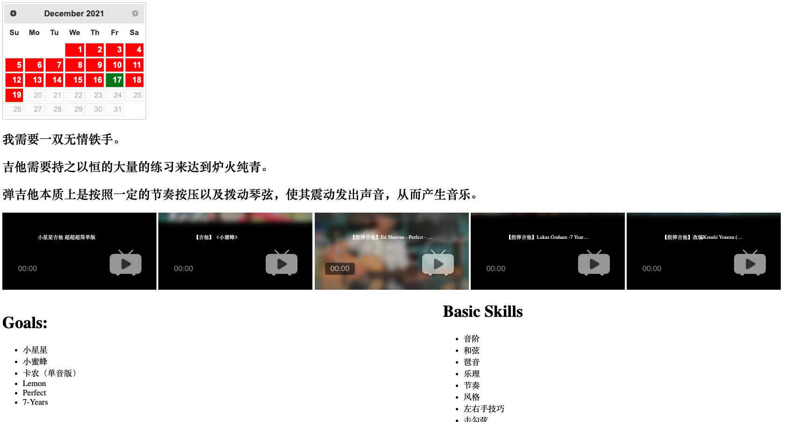
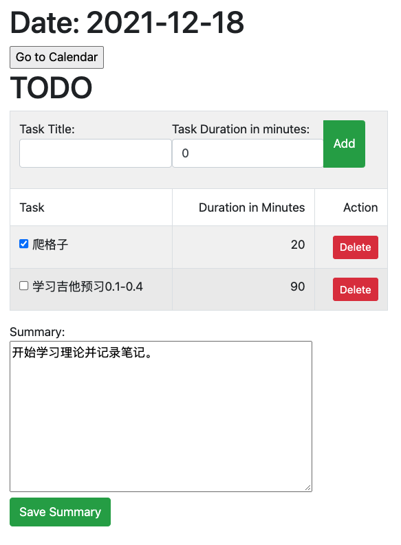

# ASP.NET Core - Guitar Learning Management System

## Motivation

The main purpose of this project is to practice my basic understanding about ASP.NET Core, mainly how to perform CRUD with it. 

## Introduction

This project is a learning management system for guitar practicing, it mainly consists of two features, the attendence system and to-do list.

With this project, guitar learner could set to-do for every day and view the completion status on the calendar of the attendence system. 

## ScreenShot

## Tech Stack

### server: ASP.NET Core

- Routing
- Controller
- Model binding
- Model validation
- Depedency injection
- Razor page

### database: sql server

### database design

Two tables:

1. GuitarPracticeCards -> A card is identified by a date string like 2021-12-18
   1. A GuitarPractice Cards has many todo items to form a todo list.
2. TodoItemLists -> A table for todo items.
   1. Each todo item has a foreign key linked to a GuitarPracticeCard.

## Features

### Version 1: cost 11 hours

- [x] Calendar shows completion status for each day -> Like leetcode attendance  
  - Green -> Completed
  - Red -> Not Completed
- [x] To-Do list based on date
- [x] A summary text section for each day
- [x] A home page

## Difficulties

- How to use EF Core in ASP.NET Core
  1. create a class inherits from DbContext
  2. Implement Repository pattern
  3. In startup.cs, register AddDbContextPool service
  4. In startup.cs, register repository interfance and instance via dependency injection
- How to pass parameter with RedirectToAction()
- Modeling binding with [Route({param1})]

- B站视频 的API的参数Manual

  - https://www.cnblogs.com/wkfvawl/p/12268980.html

- the View related problems

  - How to call the backend API from html page?

    - Use $.ajax and set the async to false.

      $.ajax({
                  url: '@Url.Action("isDone", "Home")' + "/" + dateStr,
                  type: "GET",
                  success: function (data) {
                      flag = data;
                  },
                      async: false
       });

  - How to pass the data in model to the backend API?

    - @Html.HiddenFor(model => model.DateStr)

## Future Improvement

- [ ] EF Core 得学会 用熟练，CRUD的下一层级。
- [ ] LINQ的学会怎么去写。
- [ ] 前段基础知识十分薄弱，连HTMl都用不熟练。
- [ ] 当前网站反应过慢，需要进一步优化。-> 可以用document-based database来代替sqlserver，这样子就不需要join的操作。 
